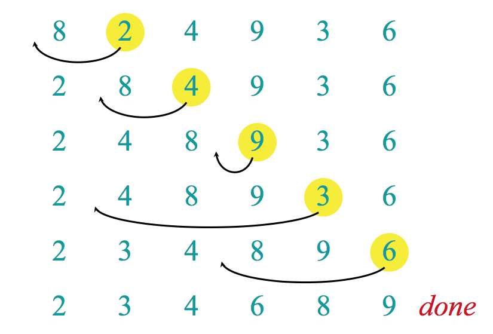

# InsertionSort

> Golang InsertionSort

- Insertion sort เป็นการเรียงข้อมูลโดยใช้หลักการ เมื่อเจอตัวเลขที่มีค่าน้อยกว่าตัวก่อนหน้าให้นำตัวเลขนั้นไปอยู่ตำแหน่งที่มันควรจะอยู่ใน array ดังรูปภาพด้านล่าง

