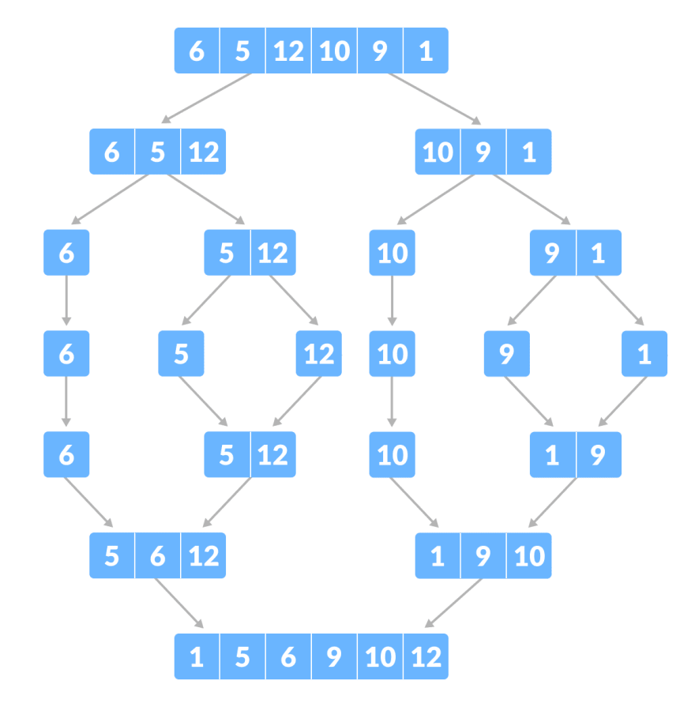

# MergeSort

> Golang MergeSort

- Merge Sort เป็น Sort Algorithm ที่เร็วที่สุด โดยมีอัตราการเติบโตของฟังชั่นเพียง O(nlogn) มีหลักการคือ เเบ่ง Array เป็น 1/2 เรื่อยๆจนเหลือ ขนาด = 1 เเล้วนำ Array ย่อยๆเเต่ละตัวมา Merge กัน โดยอาศัยหลักการ Recursive function ช่วยในการแบ่ง Array

