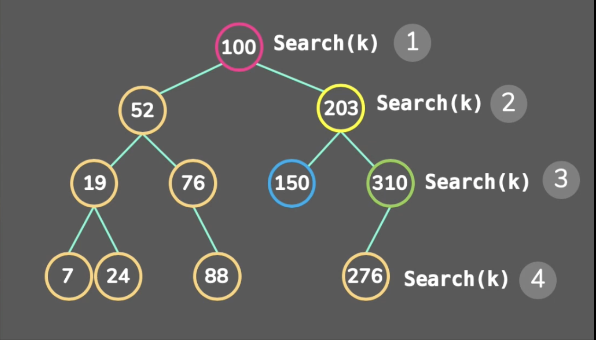

# Binary Search Tree

> Golang Binary Search Tree

- หลักการคือ Node ที่มี Data มากกว่า Node ก่อนหน้า จะให้ Node นั้นอยู่ทางด้านขวา ส่วน Node ที่มี Data น้อยกว่า Node ก่อนหน้า จะให้ Node นั้นอยู่ทางด้านซ้าย ทำแบบนี้ไปเรื่อยๆจนครบทุก Node โดยใบของ Tree จะเก็บ Pointer เป็นค่า Nil หรือว่า NULL Pointer

ref : https://youtu.be/-oYitelECuQ

