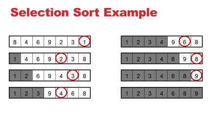
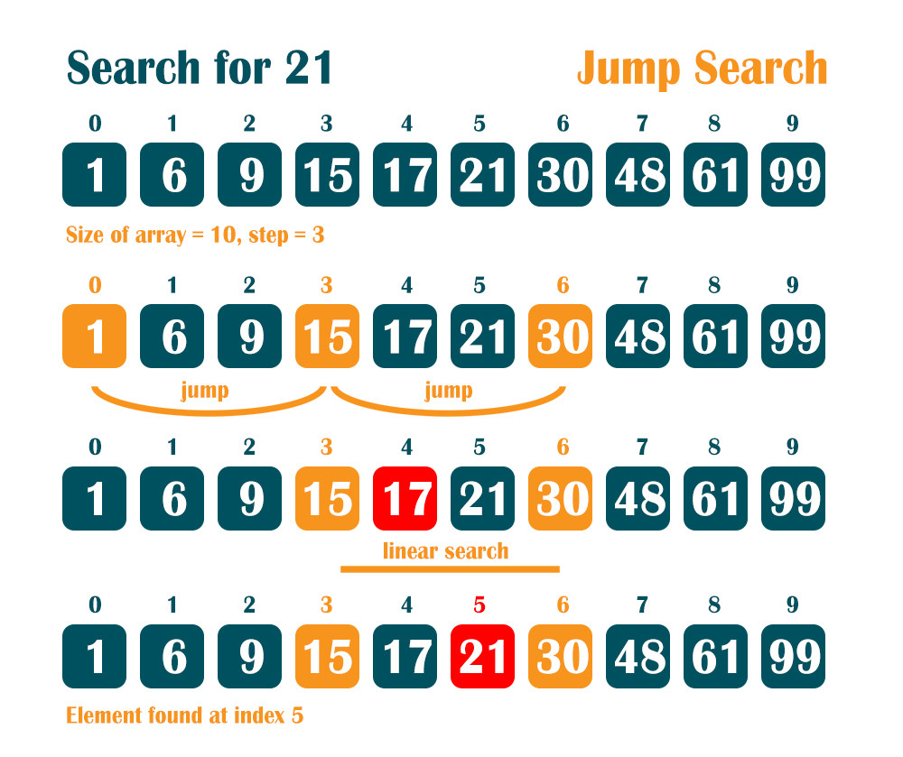
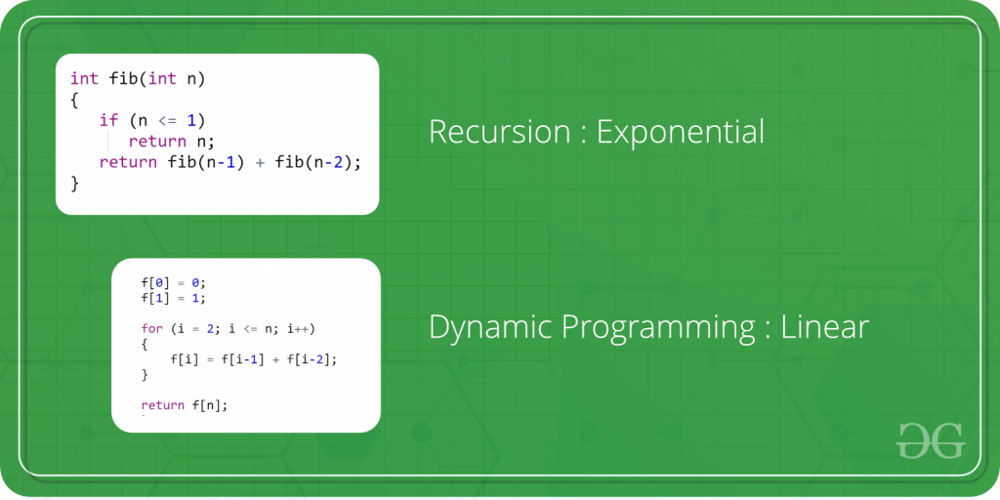
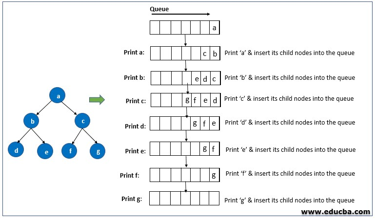
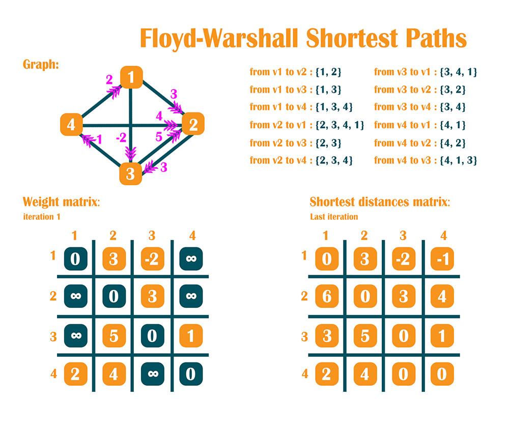
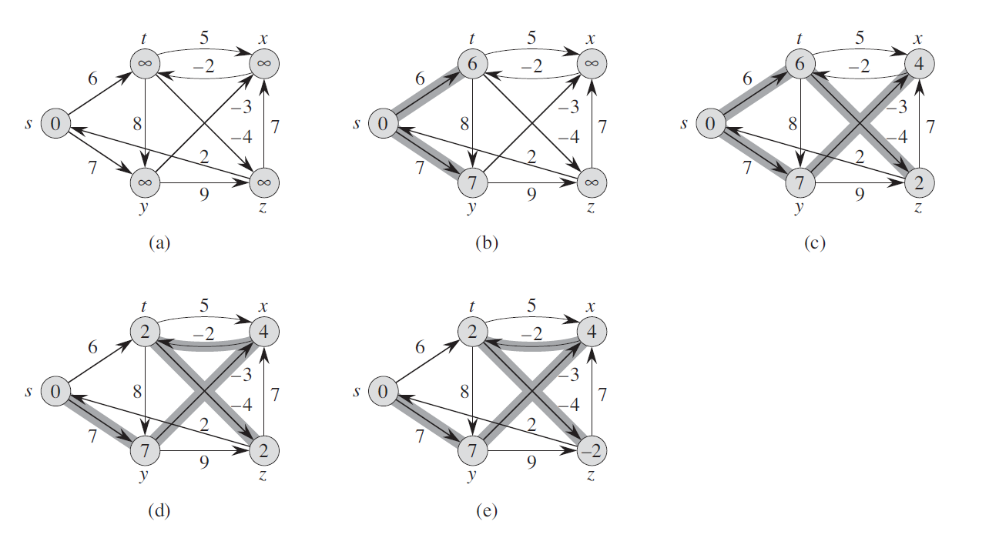
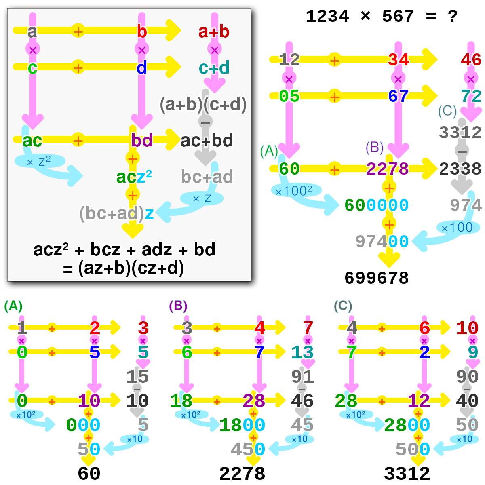

# Data Structures and Algorithms

<details>
  <summary>Work Tree</summary>

- [DataStructure](https://github.com/nutthanonn/data-structure-and-algorithm/tree/main/DataStructure)

  - Pointer
  - [Stack](https://github.com/nutthanonn/data-structure-and-algorithm/tree/main/DataStructure/stack)
  - [Queue](https://github.com/nutthanonn/data-structure-and-algorithm/tree/main/DataStructure/queue)
  - [LinkedList](https://github.com/nutthanonn/data-structure-and-algorithm/tree/main/DataStructure/linkedlist)
  - [Heap](https://github.com/nutthanonn/data-structure-and-algorithm/tree/main/DataStructure/heaps)
  - [Binary Search Tree](https://github.com/nutthanonn/data-structure-and-algorithm/tree/main/DataStructure/Tree%20%26%20Traversal)
    - [In-order](https://github.com/nutthanonn/data-structure-and-algorithm/tree/main/DataStructure/Tree%20%26%20Traversal/InOrderTree)
    - [Pre-order](https://github.com/nutthanonn/data-structure-and-algorithm/tree/main/DataStructure/Tree%20%26%20Traversal/PreOrderTree)
    - [Post-order](https://github.com/nutthanonn/data-structure-and-algorithm/tree/main/DataStructure/Tree%20%26%20Traversal/PostOrderTree)
    - [Level-order](https://github.com/nutthanonn/data-structure-and-algorithm/tree/main/DataStructure/Tree%20%26%20Traversal/LevelOrderTree)

- [Algorithms](https://github.com/nutthanonn/data-structure-and-algorithm/tree/main/Algorithms)

  - [Sort](https://github.com/nutthanonn/data-structure-and-algorithm/tree/main/Algorithms/Sort)

    - [Bubble Sort](https://github.com/nutthanonn/data-structure-and-algorithm/tree/main/Algorithms/Sort/BubbleSort)
    - [Insertion Sort](https://github.com/nutthanonn/data-structure-and-algorithm/tree/main/Algorithms/Sort/InsertionSort)
    - [Selection Sort](https://github.com/nutthanonn/data-structure-and-algorithm/tree/main/Algorithms/Sort/SelectionSort)
    - [Merge Sort](https://github.com/nutthanonn/data-structure-and-algorithm/tree/main/Algorithms/Sort/MergeSort)

    - [Counting Sort](https://github.com/nutthanonn/data-structure-and-algorithm/tree/main/Algorithms/Sort/CountingSort)

    - [Quick Sort](https://github.com/nutthanonn/data-structure-and-algorithm/tree/main/Algorithms/Sort/QuickSort)

  - [Searching](https://github.com/nutthanonn/data-structure-and-algorithm/tree/main/Algorithms/Searching)
    - [Binary Search](https://github.com/nutthanonn/data-structure-and-algorithm/tree/main/Algorithms/Searching/BinarySearch)
    - [Jump Search](https://github.com/nutthanonn/data-structure-and-algorithm/tree/main/Algorithms/Searching/JumpSearch)
    - [Linear Search](https://github.com/nutthanonn/data-structure-and-algorithm/tree/main/Algorithms/Searching/LinearSearch)
  - [Dynamic Programming](https://github.com/nutthanonn/data-structure-and-algorithm/tree/main/Algorithms/DynamicProgramming)
    - fibonacci problem
  - Tree & Graph

    - [Depth First Search](https://github.com/nutthanonn/data-structure-and-algorithms/tree/main/Algorithms/Graph/DFS)
    - [Bepth First Search](https://github.com/nutthanonn/data-structure-and-algorithms/tree/main/Algorithms/Graph/BFS)
    - [Graph Coloring](https://github.com/nutthanonn/data-structure-and-algorithms/tree/main/Algorithms/Graph/GraphColoring)
    - [Minimum Spanning Tree](https://github.com/nutthanonn/data-structure-and-algorithms/tree/main/Algorithms/Graph/MinimumCostSpanningTree)

      - [Kruskal's Algorithm](https://github.com/nutthanonn/data-structure-and-algorithms/tree/main/Algorithms/Graph/MinimumCostSpanningTree/Kruskals)

    - [Shortest Path](https://github.com/nutthanonn/data-structure-and-algorithms/tree/main/Algorithms/Graph/ShortestPath)
      - [Floyd Warshall Algorithm](https://github.com/nutthanonn/data-structure-and-algorithms/tree/main/Algorithms/Graph/ShortestPath/FloydWarshall)
      - Dijkstra's Algorithm
      - [Bellman Ford Algorithm](https://github.com/nutthanonn/data-structure-and-algorithms/tree/main/Algorithms/Graph/ShortestPath/BellmanFord)

  - Array && Linkedlist
    - [inplace](https://github.com/nutthanonn/data-structure-and-algorithm/tree/main/Algorithms/Array/inplace)
    - [Min Max](https://github.com/nutthanonn/data-structure-and-algorithm/tree/main/Algorithms/Array/Min-Max)
    - [Kadane's Algorithm](https://github.com/nutthanonn/data-structure-and-algorithms/tree/main/Algorithms/Array/Kadane)
    - [Floyd’s Cycle Detection Algorithm](https://github.com/nutthanonn/data-structure-and-algorithms/tree/main/Algorithms/Array/Floyd%E2%80%99sCycleDetection)
  - Number
    - [karatsuba](https://github.com/nutthanonn/data-structure-and-algorithms/tree/main/Algorithms/Number/Karatsuba)

</details>

> Table of Contents

## Data Structures

- [pointer](#pointer)
- [Stack](#stack)
- [Queue](#queue)
- [Likedlist](#linkedlist)
- [Binary Tree](#binary-tree)
- [Tree Traversal](#tree-traversal)
- [Heaps](#heaps)

## Algorithms

- [Sorting](#sorting)
- [Searching](#searching)
- [Dynamic Programming](#dynamic-programming)
- [Graph and Tree](#graph-and-tree)
- [Array and Linkedlist](#array-and-linkedlist)
- [Number](#number)

<hr/>
<br/>
<br/>
<br/>

# Stack

> Stack :bowl_with_spoon:

[top](#data-structures)

- หลักการของ Stack ให้นึกถึงการวางจานซ้อนๆกันเป็นชั้นๆสังเกตุได้ว่าจานที่วางใบแรกจะเมื่อเรานำออกทีละใบ จานใบแรกที่วางจะออกเป็นลำดับสุดท้าย
- `Last in first out [LIFO]`
  - push :arrow_right: push ลง stack
  - pop :arrow_right: pop ตัวสุดท้ายออกจาก stack

<p align="center">

</p>

# Queue

> Queue :walking: :walking: :walking:

[top](#data-structures)

- หลักการของ Queue ในนึกถึงการต่อคิวเข้าแถว คนี่เข้ามาถึงคนแรกก็จะได้ไปก่อนคนที่เข้ามาถึงคนสุดท้ายก็จะได้ไปคนสุดท้าย

- `First in first out [FIFO]`

  - push :arrow_right: push ลง queue
  - pop :arrow_right: pop ตัวแรกออกจาก queue

<p align="center">

</p>

# Linkedlist

> linkedlist :closed_book: :point_right: :green_book: :point_right: :orange_book: :point_right: :notebook: :point_right: :hole:

[top](#data-structures)

- หลักการของ linkedlist จะเป็นการเก็บข้อมูลเป็น node โดยที่ node แต่ละตัวก็จะเก็บ address ของตัวถัดไป

`Example`

```golang
type node struct {
    Val int
    Naxt *node
}

```

จะเห็นได้ชัดจากก้อน struct ตัวนี้ว่าจะเก็บ address ของ node ตัวถัดไปโดยในที่นี้เราตั้งชื่อว่า Next

<p align="center">

</p>

# Binary Tree

> Binary Tree :deciduous_tree:

[top](#data-structures)

- หลักการของ Binary Tree หรือเรียกว่าต้นไม้ทวิภาค เป็นการเก็บข้อมูลแบบ Tree
  ประกอบด้วย

  - root :arrow_right: เป็นข้อมูลที่อยู่บนสุดของต้นไม้
  - leaf :arrow_right: เป็นข้อมูลที่อยู่ชั้นล่างสุดของต้นไม้
  - child :arrow_right: เป็นข้อมูลที่เป็นลูกๆของ node
  - parrent :arrow_right: เป็นข้อมูลก่อนหน้า node ปัจจุบัน

- วิธีการสร้างคือ เราจะสร้าง root มาก่อนจากนั้นเมื่อเรา add node เข้าไป ถ้า val ของ node ตัวนั้นมีค่ามากกว่า root หรือ จะให้เพิ่มไปทางขวา แต่ถ้า node ตัวนั้นมีค่าน้อยกว่า root จะให้เพิ่มไปทางซ้าย

`Example`

```golang
type node struct {
    Val int
    Left *node
    Right *node
}
```

<p align="center">

</p>

# Tree Traversal

> Tree Traversal :evergreen_tree: :palm_tree: :ear_of_rice:

[top](#data-structures)

#### การเขียน In Pre Post เขียนเหมือนกันทุกประการ เปลี่ยนแค่บรรทัดที่ append node.value

`Pre Order` :point_down:

```golang

func PRE_ORDER_TRAVERSAL(n *Node){
    if n == nil {
        // return something
    }
    // append node value to array
    TRAVERSAL(n.Left)
    TRAVERSAL(n.Right)
}

```

`In Order` :point_down:

```golang
func IN_ORDER_TRAVERSAL(n *Node){
    if n == nil {
        // return something
    }
    TRAVERSAL(n.Left)
    // append node value to array
    TRAVERSAL(n.Right)
}
```

`Post Order` :point_down:

```golang
func POST_ORDER_TRAVERSAL(n *Node){
    if n == nil {
        // return something
    }
    TRAVERSAL(n.Left)
    TRAVERSAL(n.Right)
    // append node value to array
}
```

- :point_up_2: จาก Code ด้านบน จะเห็นได้ชัดเจนเลยว่า in pre post-order มีตำเเหน่งการ append to array ที่ตามชื่อเลย

`Example`

<p align="center">

</p>

# Heaps

> heaps :cherry_blossom:

[top](#data-structures)

- `parent` คือ ตำแหน่งหลักของ Node โดย index จะห่างกันอยู่ที่ _(index-1) / 2_

- `left child` คือ ตำแหน่งของ index ที่อยู่ทางด้านช้ายของ Heaps โดย index จะห่างกันอยู่ที่ _(2 x index) + 1_

- `right child` ตำแหน่งของ index ที่อยู่ทางด้านขวาของ Heaps โดย index จะห่างกันอยู่ที่ _(2 x index) + 2_

- `heaps maxHeapiflyDown` เป็นการ pop root node ออก จากนั้นหา node ที่มากที่สุดขึ้นมาเป็น root

- `maxHeapifly` เป็น function ที่ไว้ตรวจดูว่า node ที่เราเพิ่งจะ insert เข้าไปนั้น มันมีค่ามากกว่า parent node ของมันหรือไม่ ถ้ามีค่ามากกว่าก็จะเรียกใช้ function swap

- `Extract` เป็นการนำ root ของ Heaps ออกโดยจะนำ last index ของ array ขึ้นมาเป็น Root จากนั้นก็ทำการตรวจดูว่า child ตัวไหนมีค่ามากกว่าก็จะนำ node ตัวนั้นขึ้นมาเป็น root แทน

`Example`

<p align="center">

</p>

# Sorting

> Sorting Algorithms :page_with_curl:

[top](#algorithms)

- [Bubble Sort](#bubble-sort)
- [Insertion Sort](#insertion-sort)
- [Selection Sort](#selection-sort)
- [Merge Sort](#merge-sort)
- [Counting Sort](#counting-sort)
- [Quick Sort](#quick-sort)

<hr />
<br/>
<br/>
<br/>

# Bubble Sort

> Bubble Sort 🫧

[top](#algorithms)

- Bubble sort เป็นการเรียงข้อมูลแบบสลับไปเรื่อยๆ โดยมี Algorithm คือ เมื่อตัวถัดไปมีค่าน้อยกว่าตัวปัจจุบัน ให้ทำการสลับตำแหน่ง และทำแบบนี้ไปเรื่อยๆจนกว่าจะหมด โดยอาศัยหลักการ Recursive function เข้ามาช่วย

`Example`

<p align="center">

</p>

# Insertion Sort

> Insertion Sort :cloud_with_lightning_and_rain:

[top](#algorithms)

- Insertion sort เป็นการเรียงข้อมูลโดยใช้หลักการ เมื่อเจอตัวเลขที่มีค่าน้อยกว่าตัวก่อนหน้าให้นำตัวเลขนั้นไปอยู่ตำแหน่งที่มันควรจะอยู่ใน array ดังรูปภาพด้านล่าง

`Example`

<p align="center">

</p>

# Selection Sort

> Selection Sort :mountain:

[top](#algorithms)

- Selection Sort เป็นการเรียงข้อมูลที่เหมือนกับมนุษย์สุดๆ โดยจะมองหาตัวเลขที่น้อยที่สุดตามลำดับ การเติบโตขของฟังชั่น = O(n^2)

`Example`

<p align="center">

</p>

# Merge Sort

> Merge Sort :1st_place_medal:

[top](#algorithms)

- Merge Sort เป็น Sorting Algorithm ที่เร็วที่สุด โดยมีอัตราการเติบโตของฟังชั่นเพียง O(nlogn) มีหลักการคือ แบ่ง Array เป็น 1/2 เรื่อยๆจนเหลือ ขนาด = 1 แล้วนำ Array ย่อยๆเเต่ละตัวมา Merge กัน โดยอาศัยหลักการทำงานแบบ divide and conquer คือ เเบ่งเพื่อชนะ
  - แบ่งปัญหาออกเป็นส่วนเล็กๆ
  - แก้ปัญหานั้นโดยเป็นอิสระต่อกัน
  - นำคำตอบที่ได้จากปัญหาย่อยๆมารวมกัน
- Algorithmic Paradigm: `Divide and Conquer`

`Example`

<p align="center">

</p>

# Counting Sort

> Counting Sort :arrows_counterclockwise:

[top](#algorithms)

- Counting sort มีหลักการทำงาน คือ
  1. สังเกตุข้อมูลว่ามีข้อมูลที่ซ้ำกัน
  2. นับจำนวนข้อมูลที่ซ้ำกันว่ามีกี่ตัว
  3. นำข้อมูลที่ได้มาเรียง

`Example`

<p align="center">

</p>

# Quick Sort

> Quick Sort :zap:

[top](#algorithms)

- QuickSort มี 4 ขั้นตอน

  - 1 if len(arr) < 2 break
  - 2 เลือกตัวเลขขึ้นมาหนึ่งตัว เรียกเลขตัวนี้ว่า Pivot
  - 3 แบ่ง Array เป็น 2 ก้อน ก้อนแรกทุกตัวจะมีค่าน้อยกว่า Pivot ก้อนสองทุกตัวจะมีค่ามากกว่า Pivot
  - 4 กลับไปทำขั้นตอนแรกใหม่กับ Array1 และ Array2

- Algorithmic Paradigm: `Divide and Conquer`

`Example`

<p align="center">

</p>

# Searching

> Searching Algorithms :mag: :mag: :mag:

[top](#algorithms)

- [Binary Search](#binary-search)
- [Jump Search](#jump-search)
- [Linear Search](#linear-search)

<hr />
<br/>
<br/>
<br/>

# Binary Search

> Binary Search Algorithm :seedling: :mag:

[top](#algorithms)

- Binary Search เป็น Algorithm ไว้ค้นหาข้อมูลสำหรับ Array ที่ถูก Sort ข้อมูลมาแล้ว

1. หาค่า mid-index
2. ถ้าค่า array[mid] > target ก็เปลี่ยนไปหาตั้งแต่ช่วง index mid ถึง len(array) - 1 ถ้าค่า array[mid] < target ก็เปลี่ยนไปหาช่วง index 0 ถึง mid-1

3. ทำซำ้ 1-2 จนกว่า array[mid] = target ให้ return index mid

`Example`

<p align="center">

</p>

# Jump Search

> Jump Search Algorithm :mag: see_no_evil:

[top](#algorithms)

- Jump Search เป็น Algorithm ไว้ค้นหาข้อมูลสำหรับ Array ที่ถูก Sort ข้อมูลมาแล้ว
  หลักการคือ เราจะทำการ search แบบกระโดด โดยจะกระโดดทีละ รากที่สองของ array size

`Example`

<p align="center">

</p>

# Linear Search

> Linear Search :mag: :arrow_right:

[top](#algorithms)

- Linear Search เป็น Searching Algorithm แบบง่ายที่สุด เพราะเปรียบเสมือนการมองไล่ดูเเต่ละตัวเลยว่าตรงกับ Target หรือไม่

`Example`

<p align="center">

</p>

# Dynamic Programming

> Dynamic Programming :desktop_computer:

[top](#algorithms)

- Dynamic Programming เป็นเทคนิคหนึ่งสำหรับแก้ปัญหาที่ซับซ้อน โดยการแก้ปัญหาย่อย ตั้งแต่ปัญหาขนาดย่อยที่สุดขึ้นมาก่อน แล้วค่อย ๆ เพิ่มขอบเขตขึ้นมาจนถึงปัญหาที่มีขนาดใหญ่ที่สุด ส่วนมากมักจะประยุกต์ใช้กับ recursive function

`Example`

<p align="center">

</p>
<hr/>

<br/>
<br/>
<br/>

# Graph and Tree

[top](#algorithms)

- [Depth First Search](#depth-first-search)
- [Breadth First Search](#breadth-first-search)
- [Graph Coloring](#graph-coloring)
- [Minimum Spanning Tree](#minimum-spanning-tree)
- [Shortest Path](#shortest-path)

<hr/>
<br/>
<br/>
<br/>

# Depth First Search

> Depth First Search Algorithm :mag:

- Depth First search หรือเราเรียกกันว่า การค้นหาแบบลึกจะเป็นการใช้ stack เข้ามาช่วย การค้นหาแบบลึกคือเราจะค้นหาไปให้ได้ลึกที่สุดก่อนจากนั้นก็ค่อยออกมาค้นหาเส้นทางอื่น

`Example`

<p align="center">

</p>

# Breadth First Search

> Breadth First Search Algorithm :mag:

[top](#algorithms)

- Bepth First Search หรืออีกชื่อนึงคือ การค้นหาแบบกว้างจะใช้ Queue ในการช่วย การค้นหาแบบกว้างคือเราจะค้นหากว้างๆรอบๆให้หมดก่อนแล้วค่อยค้นหาลงไปในชั้นถัดๆไปของ graph

`Example`

<p align="center">

</p>

# Minimum Spanning Tree

> Minimum Spanning Tree Algorithms :evergreen_tree:

[top](#algorithms)

- [Kruskal's Algorithm](#kruskal's-algorithm)

<hr/>
<br/>
<br/>
<br/>

# Kruskal's Algorithm

> Kruskal's Algorithm :cactus:

[top](#algorithms)

- kruskal's algorithm เป็นตัวช่วยในการหาเส้นทางที่ส้นที่สุดที่เราจะสามารถไปได้ทุกจุดใน graph โดยหลักการคือ เราจะเลือกเส้นทางที่น้อยที่สุดในกราฟทั้งหมด แต่ต้องดูด้วยว่าการเลือกเส้นทางนั้นจะไม่ทำให้เกิด cycle

`Example`

<p align="center">

</p>

# Shortest Path

> Shortest Path Alogorithms :potted_plant:

[top](#algorithms)

- [Floyd Warshall Algorithm](#floyd-warshall-algorithm)
- [Bellman Ford Algorithm](#bellman-ford-algorithm)

<hr/>
<br/>
<br/>
<br/>

# Floyd Warshall Algorithm

> Floyd Warshall Algorithm :seedling:

[top](#algorithms)

- FloyWarshall เป็น Algorithm ที่ทำให้ผมว้าวมากๆ เพราะสามารถหา shortest path ได้ทุกเส้นทางเลย แต่แลกมากับเวลาที่นานมากคือ `o(n^3)` Algorithm ตัวนี้ไม่ยาก เพียงแค่ใช้ Adjacency matrix

`Example`

<p align="center">

</p>

# Bellman Ford Algorithm

> Bellman Ford single source shortest path Algorithm :herb:

[top](#algorithms)

- Algorithm ของ BellmanFord เกิดขึ้นมาเพื่อแก้ไขปัญหา path ที่มีค่าติดลบ ที่ Dijkstra's Algorithm ไม่สามารถแก้ได้แต่ BellmanFord มีปัญหาตรงที่ ถ้าเกิด Cycle ใน graph แล้วผลรวม Weight ของ Cycle นั้น มีค่าติดลบ จะทำให้เกิดปัญหาขึ้น แต่ถ้าผลรวมเป็นบวกก็จะไม่มีปัญหา

`หลักการ`

_1_ ให้จุดเริ่มต้นเป็น 0 และทุกจุดมี distance เป็น Inf

_2_ จับ Egde มาเป็นคู่ๆ ถ้า distance ของตัวแรก + weight ของตัวถัดไป แล้วมีค่าน้อยกว่า distance ของตัวถัดไป ให้ distance ของตัวถัดไป เก็บค่า distance ของตัวก่อนหน้่า + weight

## Example

```golang
//solution
.
.
.
if dist[u] != int(math.Inf(1)) && dist[u]+w <  dist[v] {
		dist[v] = dist[u] + w
}
```

_3_ ทำซ้ำข้อ 1-3 จนกว่าจะครบจำนวน Vertex - 1

`Example`

<p align="center">

</p>

# Array and Linkedlist

[top](#algorithms)

- [Inplace](#inplace)
- [Min-Max](#min-max)
- [Kadane's Algorithm](#kadane's-algorithm)
- [Floyd’s Cycle Detection Algorithm](#floyd's-cycle-detection-algorithm)

<hr/>
<br/>
<br/>
<br/>

# Inplace

> inplace Algorithm :books:

[top](#algorithms)

- Inplace Algo เป็นอัลกอที่ไว้ Reverse Array โดยใช้ for-loop คิดถึงแค่ n ÷ 2 ของ size of array

# Min-Max

> Tournament Method Algorithm in Golang :bookmark:

[top](#algorithms)

- ตัวนี้เป็น Algorithms ในการหา max-min โดยที่ใช้ divide and conquer

- Algorithmic Paradigm: `Divide and Conquer`

# Kadane's Algorithm

> Kadane's Algorithm :bookmark_tabs:

[top](#algorithms)

- ไว้หา sub array ที่มีผลรวมมากที่สุด

# Floyd’s Cycle Detection Algorithm

> Floyd’s Cycle Detection Algorithm :cyclone:

[top](#algorithms)

- Aloorithm นี้ไว้หา loop ของ linkedlist โดยจะให้ q ถัดไปทีละ 1 node แต่ p จะถัดไปทีละ 2 node และใน Cycle ถ้า p == q มันก็จะรู้ได้ทันทีเลยว่า linkedlist นี้มี Cycle

# Number

> Number Alogorithms :1234:

[top](#algorithms)

- [karatsuba](#karatsuba)

<hr/>
<br/>
<br/>
<br/>

# karatsuba Algorithm

> karatsuba Algorithm in golang :asterisk:

[top](#algorithms)

- เป็น Algorithm ที่ไว้ใช้ในการคูณเลขจำนวนมากๆ
- Algorithmic Paradigm: `Divide and Conquer`

`Example`

<p align="center">

</p>
